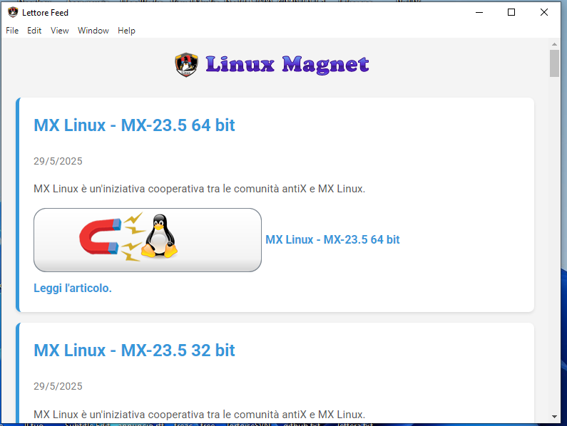

# 🚀 Linux Magnet - Il lettore di Feed con Superpoteri Magnetici! 🧲

[](https://www.electronjs.org/)
[](https://nodejs.org/)


[](https://github.com/smal82/Linux-Magnet-Distro/releases/download/1.3.0/Linux.Magnet.Setup.1.3.0.exe)


**Linux Magnet** è un'applicazione desktop cross-platform, creata con Electron, che ti permette di rimanere aggiornato sul feed di Linux Magnet con una marcia in più! 🔩 Grazie al supporto integrato per i **magnet link**, potrai scoprire e scaricare le distro in un modo completamente nuovo.



## ✨ Caratteristiche Principali

* 📰 **Lettura di Feed Semplice ed Elegante:** Interfaccia utente pulita e moderna per una lettura confortevole dei feed RSS.
* 🧲 **Supporto Magnet Link Integrato:** Individua i magnet link nei feed e scaricali direttamente dall'app.
* 🔄 **Aggiornamento Facile:** Mantieni i feed sempre aggiornati con un semplice clic sul pulsante di aggiornamento.
* ⚙️ **Cross-Platform:** Disponibile per Windows, macOS e Linux.
* 🏷️ **Informazioni Magnet Utili:** Visualizzazione del testo associato al magnet link prima dell'icona.

## 💻 Installazione

Segui questi semplici passaggi per installare e avviare Linux Magnet sul tuo sistema operativo:

### 🛠️ Prerequisiti

Prima di iniziare, assicurati di avere **Node.js** e **npm** (Node Package Manager) installati sul tuo sistema.

#### ⚙️ Windows

1.  Vai sul sito ufficiale di Node.js: [https://nodejs.org/](https://nodejs.org/)
2.  Scarica l'installer per Windows (consigliata la versione LTS).
3.  Esegui l'installer e segui le istruzioni a schermo. npm è incluso nell'installazione di Node.js.
4.  Apri il **Prompt dei comandi** (cmd) e verifica l'installazione digitando:
    ```bash
    node -v
    npm -v
    ```

#### 🍎 macOS

Esistono diversi modi per installare Node.js e npm su macOS:

**Metodo 1: Tramite l'installer dal sito ufficiale:**

1.  Vai sul sito ufficiale di Node.js: [https://nodejs.org/](https://nodejs.org/)
2.  Scarica l'installer per macOS (consigliata la versione LTS).
3.  Esegui l'installer e segui le istruzioni.

**Metodo 2: Tramite Homebrew (consigliato):**

1.  Se non hai Homebrew installato, segui le istruzioni qui: [https://brew.sh/](https://brew.sh/)
2.  Apri il **Terminale** e digita:
    ```bash
    brew install node
    ```
3.  Verifica l'installazione:
    ```bash
    node -v
    npm -v
    ```

#### 🐧 Linux

L'installazione su Linux può variare a seconda della distribuzione. Ecco alcuni metodi comuni:

**Tramite il gestore di pacchetti della tua distribuzione (esempi):**

* **Debian/Ubuntu:**
    ```bash
    sudo apt update
    sudo apt install nodejs npm
    ```
* **Fedora/CentOS:**
    ```bash
    sudo dnf install nodejs npm
    ```
* **Arch Linux:**
    ```bash
    sudo pacman -S node npm
    ```

**Tramite il sito ufficiale (pacchetto precompilato):**

1.  Vai sul sito ufficiale di Node.js: [https://nodejs.org/](https://nodejs.org/)
2.  Scarica il pacchetto per Linux (consigliata la versione LTS).
3.  Segui le istruzioni specifiche per la tua distribuzione per estrarre e installare Node.js e npm.

Verifica l'installazione aprendo il terminale e digitando `node -v` e `npm -v`.

#### 📥 Installazione di Git

Se non hai Git installato sul tuo sistema, segui le istruzioni appropriate per il tuo sistema operativo:

##### ⚙️ Windows

1.  Vai sul sito ufficiale di Git per Windows: [https://git-scm.com/download/win](https://git-scm.com/download/win)
2.  Scarica l'installer e segui le istruzioni. Assicurati di selezionare l'opzione per aggiungere Git al tuo PATH.
3.  Apri il **Prompt dei comandi** e verifica l'installazione con:
    ```bash
    git --version
    ```

##### 🍎 macOS

**Metodo 1: Tramite l'installer dal sito ufficiale:**

1.  Vai sul sito ufficiale di Git: [https://git-scm.com/download/mac](https://git-scm.com/download/mac)
2.  Scarica l'installer e segui le istruzioni.

**Metodo 2: Tramite Homebrew (consigliato):**

1.  Se non hai Homebrew, installalo da: [https://brew.sh/](https://brew.sh/)
2.  Apri il **Terminale** e installa Git:
    ```bash
    brew install git
    ```
3.  Verifica l'installazione:
    ```bash
    git --version
    ```

##### 🐧 Linux

Apri il **Terminale** e usa il gestore di pacchetti della tua distribuzione:

* **Debian/Ubuntu:**
    ```bash
    sudo apt update
    sudo apt install git
    ```
* **Fedora/CentOS:**
    ```bash
    sudo dnf install git
    ```
* **Arch Linux:**
    ```bash
    sudo pacman -S git
    ```

Verifica l'installazione con:
```bash
git --version
  ```

### ⚙️ Installazione dell'Applicazione

Una volta che Node.js e npm sono installati, segui questi passaggi per avviare Linux Magnet:

1.  **Clona il repository:**
    ```bash
    git clone https://github.com/smal82/Linux-Magnet-Distro
    cd Linux-Magnet-Distro
    ```    
2.  **Installa le dipendenze:**
    ```bash
    npm install
    ```
    Questo comando scaricherà e installerà tutte le librerie necessarie (Electron, rss-parser, dompurify).

3.  **Avvia l'applicazione:**
    ```bash
    npm start
    ```
    Questo comando avvierà l'applicazione Electron.

## 📄 Licenza

Questo progetto è rilasciato sotto la **Licenza MIT**.

Un breve riassunto della Licenza MIT:

* **Permissiva:** Consente l'uso, la copia, la modifica, l'unione, la pubblicazione, la distribuzione, la sublicenza e/o la vendita del software e delle opere derivate, senza restrizioni.
* **Requisito di Attribuzione:** Richiede che l'avviso di copyright e la nota di autorizzazione siano inclusi in tutte le copie o parti sostanziali del software.
* **Assenza di Garanzia e Responsabilità:** Il software è fornito "COSÌ COM'È", senza garanzie e senza alcuna responsabilità per eventuali danni.

Per il testo completo della Licenza MIT, consulta il file `LICENSE` nel repository.

## 🧑‍💻 Autore

Sviluppato con passione da [smal82]([https://github.com/smalnet](https://github.com/smal82)).

---

Grazie per aver utilizzato Linux Magnet! Speriamo che ti piaccia la tua esperienza di lettura di feed potenziata! 🚀
